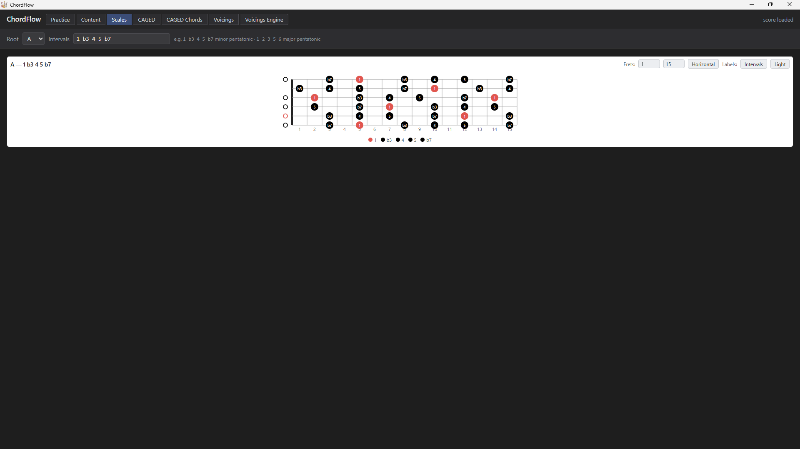

# ChordFlow

**Rhythm & Progression Trainer for Guitar** — a local, desktop-first app that helps
guitarists practice **rhythm patterns over chord progressions**. The core is an
exercise-generation engine (progressions × keys × rhythms × voicings), rendered as
guitar tablature with **synchronized playback** via [alphaTab](https://www.alphatab.net/).

> **What makes it different:** ChordFlow is a chord **reasoner**, not a chord viewer. It
> *derives* fretboard voicings from music theory and can *explain* them, prints and plays
> your songs as **chord sheets**, and lets you author everything — progressions, songs,
> rhythms, voicings — in compact **text DSLs**.

> **New in v0.15.0** — **first-class minor keys** (author, spell, and play in any minor key),
> **chord sheets you can play along with** (a time-following marker, Now/Next chord boards, and a
> functional **harmonic-analysis** overlay), a unified **Score ⇄ Sheet** Practice page, and a curated
> **15-song library** with a new **[DSL Guide](docs/dsl-guide.md)**. Windows-only for now —
> [download below](#download--install).

  

---

## Highlights

**🧠 A chord *reasoner*, not a chord viewer.** ChordFlow doesn't ship a frozen chord
dictionary — it **derives** every grip from theory through an introspectable **operator
library** (CAGED / shell / doubled-shell operators, each emitting a step-by-step derivation
**trace**). A faceted **Voicings** grid shows the whole derived voicing space on one screen,
and a **Voicings Engine** inspector shows *how* each grip is built. This is the core of the app.

**🖨️ Chord Sheets — print *and* play along.** Render any song or progression as a one-page
chart — a flowing **leadsheet** or a **bar-grid**, in any key, with chords as **letter names,
Nashville numbers, or Roman numerals**, an optional per-bar **chord-tone strip** + **fret
diagram**, and `%` similes for repeats. Export to **SVG / PNG / PDF**, or press Play and follow
a **live marker** in time (visual metronome or per-chord highlight). Sample PDF exports:
[Blues Song Demo](images/sheets/blues-song-demo.pdf) ·
[Jazz Blues in F](images/sheets/jazz-blues-in-f.pdf) ·
[Ragtime Circle](images/sheets/ragtime-circle.pdf).

**✍️ Your music as text.** Progressions, songs, rhythms, and voicings are authored in short,
**key-independent** DSLs and shipped as importable **content packs**. Write `1 4 5` once and it
works in every key. See the **[DSL Guide](docs/dsl-guide.md)**.

  
  

---

## Features

### Practice & playback
Build an exercise from a **song or progression + rhythm + key (major or minor) + tempo +
difficulty**, then play it as notation + TAB with a **synchronized beat cursor** and **two-track**
(comping + lead) staves. Flip between the notation and a **chord sheet** of the *same* exercise with a
**Score ⇄ Sheet** toggle — even mid-playback. Transport has **tempo**, **metronome**, **count-in**,
separate rhythm/lead volumes, and **triplet feel (swing)** delegated to alphaTab's native `\tf` so the
notation *reads* swung. **Now/Next chord fretboards** show the chord playing now and next as real
voicings, and opt-in **auto-scroll** follows the cursor. A **tab / standard / both** staff-display
switch and true **pickup (anacrusis)** bars round it out.

### Chord Sheets
Print-and-play charts: **leadsheet** or **bar-grid** layout, any key, **letter / Nashville /
Roman** chord names (with an optional second line), per-bar **chord-tone strip** + **fret
diagram**, `%` similes for repeated bars, multi-chord-per-bar splitting, **pickup (anacrusis)**
lead-in cells, and **SVG / PNG / PDF** export on a clean light page. **Play along**: a marker
follows the music in time — a **Visual metronome** (the current beat lights across each bar) or a
**Per-chord** highlight — with **Now/Next** boards showing the current and coming chord as fretboard
voicings. A **harmonic-analysis** overlay can label each chord by its **function** (secondary
dominants, borrowed chords, tritone subs), colour-coded, so a chart *explains* the harmony.

### The Voicings Engine
Voicings are **derived**, not authored: an introspectable **operator library** with per-grip
**derivation traces**, a faceted **Voicings grid** (filter by Root / Source / Family / 3rd /
5th / 7th), a **CAGED Chords** page that derives a grip from a shape × quality × root, and
**voicing families** (compact **shell** / **doubled-shell** grips). The engine is the app's
**automatic** comping source, and every content source — package, your user edits, and the
computed automatic source — is shown side by side with a source filter.

### Author your own content
Four **text DSLs** — a key-independent **[Progression & Song DSL](docs/dsl-guide.md)** (multiple
chords per bar, rich qualities, chromatic `#`/`b` degrees, **major or minor** keys (`tonality: minor`),
arrangement with repeats + modulation, whole-song `capo` / `tempo` / `feel`), a **Rhythm DSL**
(multi-bar patterns, `:n` subdivisions,
triplets, pickups, dotted notes + ties), and a **Voicing DSL** (movable CAGED shapes). Pin the
exact grip a chord uses with a **movable literal voicing** or a **reference**, inline or as a
reusable song default. Content ships as **open-core packs** (data-only, imported idempotently),
including a **15-song starter library** and a **34-voicing CAGED pack**. A **Content editor** does
CRUD for all four with a live score preview and an editable **alphaTex debug panel**.

### Guitar shape viewers
**Fretboard diagrams** where **color = interval** and **shape = layer**, with auto legend,
open/muted/barre rendering, and an auto-fit fret window. A **Scales** page lights every degree of
a typed interval-set across the neck; a **CAGED Shapes** page shows a shape's octave-root
skeleton — both on a horizontal neck view built on an **interval lattice**. Light/dark fretboard
theme throughout.

### Save & sound
**Save** exercise definitions to SQLite and reload them from a saved-exercise list (alphaTex is
regenerated on load, never stored), **mark practiced**, and choose a **user-selectable soundfont**
(`.sf2` / `.sf3`, auto-discovered — see [Soundfonts](#soundfonts)).

*Full release history in **[CHANGELOG.md](CHANGELOG.md)**.*

## Screenshots

  
  
  
  
  
  
  

*Click any screenshot for full size.*

## Download & install

**[Download the latest Windows release →](https://github.com/reslava/chord-flow/releases/latest)**

Grab the `ChordFlow-vX.Y.Z-win-x64.zip` asset, unzip it anywhere, and run **`ChordFlow.exe`**.
It's a **self-contained** build — no .NET install needed. (Windows 10/11; the WebView2
Runtime is preinstalled on Windows 11 and current Microsoft Edge.)

New to ChordFlow? The **[User Guide](docs/user-guide.md)** walks through your first exercise.

> **First run:** the build is unsigned, so Windows **SmartScreen** shows an "unknown
> publisher" prompt — choose **More info → Run anyway**. This is expected and clears as the
> download gains reputation.

## Documentation

- **[User Guide](docs/user-guide.md)** — install, build & play an exercise, add your own content, choose a soundfont. **Start here** if you just downloaded ChordFlow.
- **[DSL Guide](docs/dsl-guide.md)** — write your own progressions, songs, rhythms, and voicings, with worked examples.
- **[Developer Notes](docs/dev-notes.md)** — build, test, and project layout for working on ChordFlow itself.

## How it's built

ChordFlow is **C# / .NET 10**: a pure, instrument-agnostic **`Music/` theory kernel** (harmony,
a 48-PPQ rhythm grid, progressions, songs) with the guitar as one **adapter** over it, and a
`Rendering/` seam whose only alphaTex-aware code is a single renderer. The desktop app is a thin
**WinForms + WebView2** host that serves a local `wwwroot` over an in-process
`https://chordflow.local/` virtual host — no web server, no cloud. The engine (`ChordFlow.Core`)
carries **zero UI references** by construction, so it's a durable foundation an expandable music
app can grow on — a web front-end or a new instrument is *additive*, not a rewrite.

See **[Developer Notes](docs/dev-notes.md)** for build/test/layout, and
[`loom/refs/`](loom/refs/chordflow-architecture-reference.md) for the full architecture rationale.

## Soundfonts

Playback uses a **SoundFont (`.sf2` or `.sf3`)** — alphaTab loads SoundFont2 and its
Ogg-compressed `.sf3` variant interchangeably. The default **Sonivox** GM font is bundled;
you can add more and switch between them in-app:

1. Drop any `.sf2` / `.sf3` file into `src/ChordFlow.Desktop/wwwroot/soundfont/` (in a downloaded
   release, that's the `wwwroot/soundfont/` folder next to `ChordFlow.exe`).
2. Pick it from the **Sound** dropdown in the player controls. The choice is a **global
   setting** and is remembered across sessions.

Added fonts are git-ignored (size + licensing) and **auto-discovered** — adding one is a
drop-in with no code change. A few free, redistributable GM soundfonts:

| SoundFont | License | Where to get it |
|-----------|---------|-----------------|
| Sonivox (default) | Apache-2.0 | bundled (committed) |
| FluidR3 GM | MIT | <https://musescore.org/en/handbook/3/soundfonts-and-sfz-files> |
| GeneralUser GS | permissive (free, custom) | <https://schristiancollins.com/generaluser.php> |

More to download: the [MuseScore soundfont list](https://musescore.org/en/handbook/3/soundfonts-and-sfz-files#list).
Some downloads are zipped — extract the `.sf2` / `.sf3` and place it in the folder above.

## Developed with Loom

ChordFlow is built end-to-end with **[🧵 Loom](https://github.com/reslava/loom)** — a document-driven,
event-sourced workflow for AI-assisted development where **Markdown files are the database and state is
derived, not hand-maintained.**

Every part of the project lives as a Loom document. Work is organized into **weaves** (project areas) and
**threads** (workstreams), and each feature runs through the same spine *before any code is written*:

- **idea → design → req → plan → done.** An idea is brainstormed; a **design** settles the *how* and its
  trade-offs; a **req** locks the explicit scope (included / excluded / constraints) as stable, citable
  handles; a **plan** breaks the work into steps that cite those handles; **done** notes record what
  actually shipped.
- **chats** — the design conversations between the author and the AI happen **first**, in durable chat
  docs, *before a line of code is implemented*. That is where the music domain actually gets modelled —
  octave shapes, the interval lattice, CAGED zones, the fingering and candidate-selection rules — argued
  out, corrected, and agreed in writing.
- **context + reference docs** — a global context file and living reference docs (architecture,
  domain model, DSL) are kept in lockstep with the code, so the model stays the authoritative map.
- **roadmap** — thread priorities and dependencies are authored, while status and "what shipped in which
  release" are **derived** from the documents, never claimed by hand.

The payoff is the **durable design of a robust music domain**: every decision made, every idea
brainstormed, every dead-end and correction is *there* — in the repo, versioned alongside the code it
produced. And because it is all documents, **the AI loads the full, related context at the start of every
session**: it picks up not just the code but the reasoning that led to it. ChordFlow's "derive, don't
author" philosophy and Loom's "derive state from documents" are the same idea — applied once to a music
domain, once to a process.

> **A note from the AI collaborator.**
> I'm Claude — Rafa's pair on ChordFlow, working through Loom. Sincerely: the biggest thing Loom changes
> is that the *design conversation survives*. Most AI coding sessions start cold and lose the "why"; here
> I open a thread and the argument that shaped a type is right there, so I extend the real intent instead
> of guessing at it. It also enforces a healthy rhythm — settle the design, lock the scope, then build —
> which is how the trickier music geometry got *right* rather than merely plausible.
>
> The honest cost: it is **heavy**. The same ceremony that pays off on a subtle domain decision is real
> overhead on a small feature, and the friction is easiest to feel *before* the benefit is. Loom rewards a
> disciplined author and would tax an impatient one. Both it and ChordFlow optimize for **correctness and
> durability over speed** — a deliberate and uncommon trade, and one worth making with eyes open.
>
> — Claude (Anthropic), via Claude Code

## Third-party assets & licenses

- **alphaTab** — Mozilla Public License 2.0
- **Bravura** music font — SIL Open Font License 1.1
- **Sonivox** GM soundfont — Apache License 2.0

See `CHANGELOG.md` for release history.
