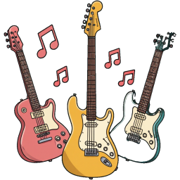
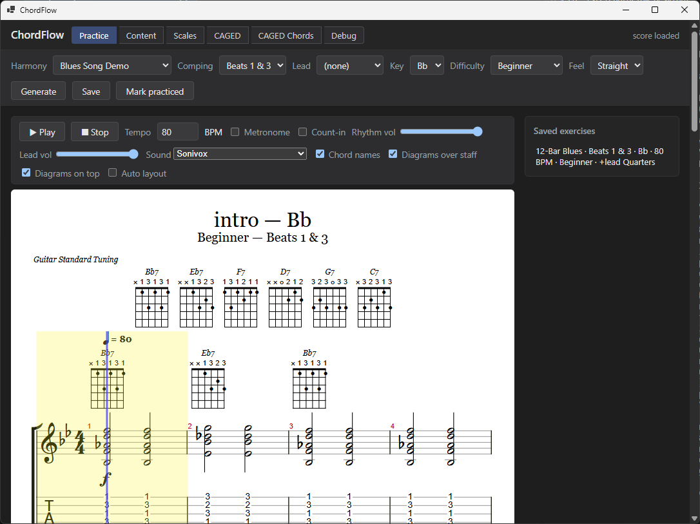
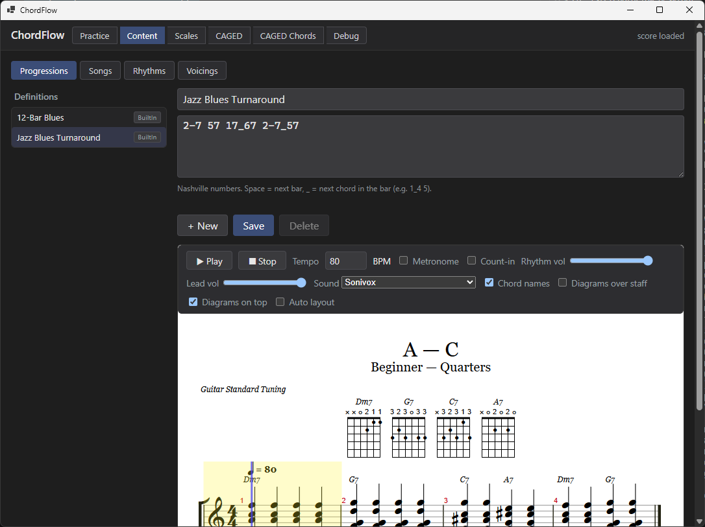
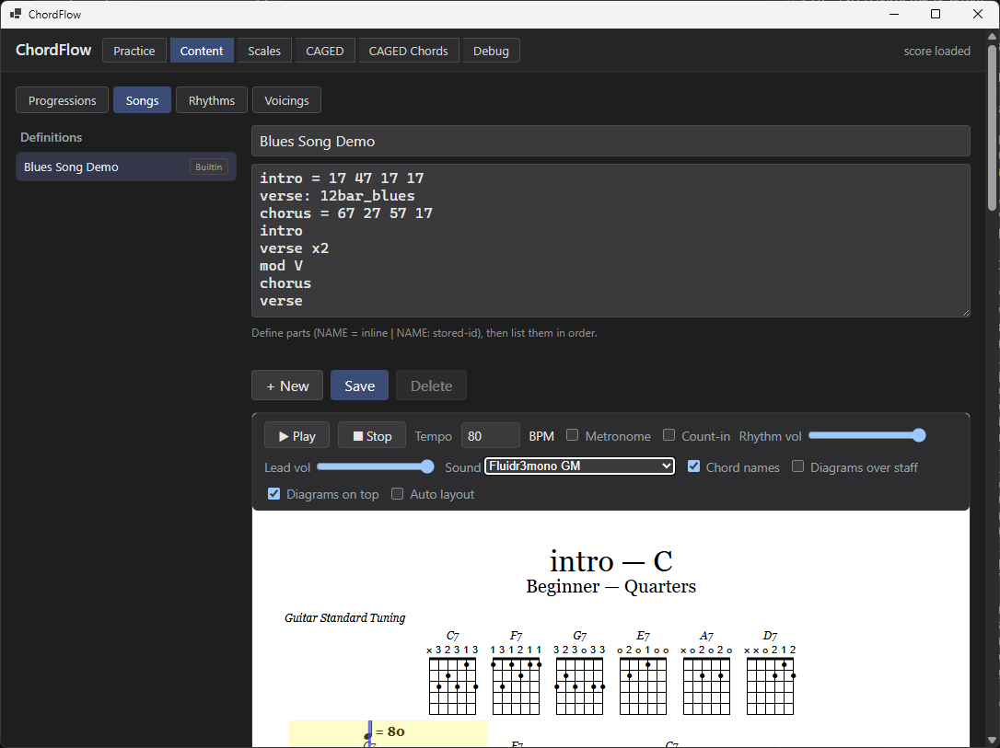
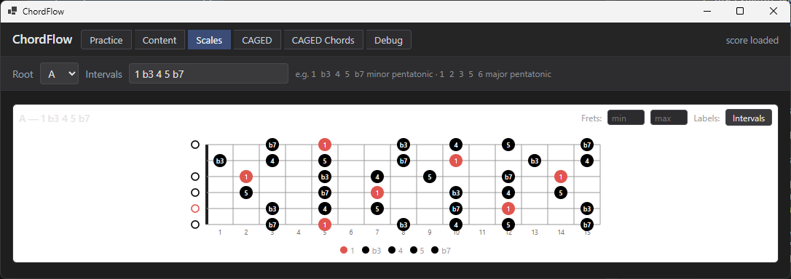
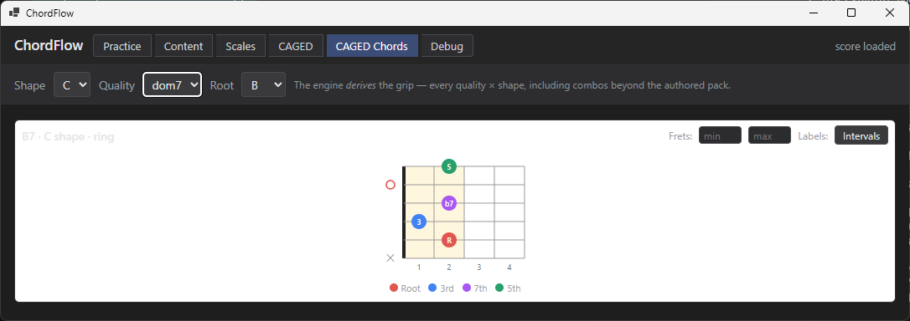
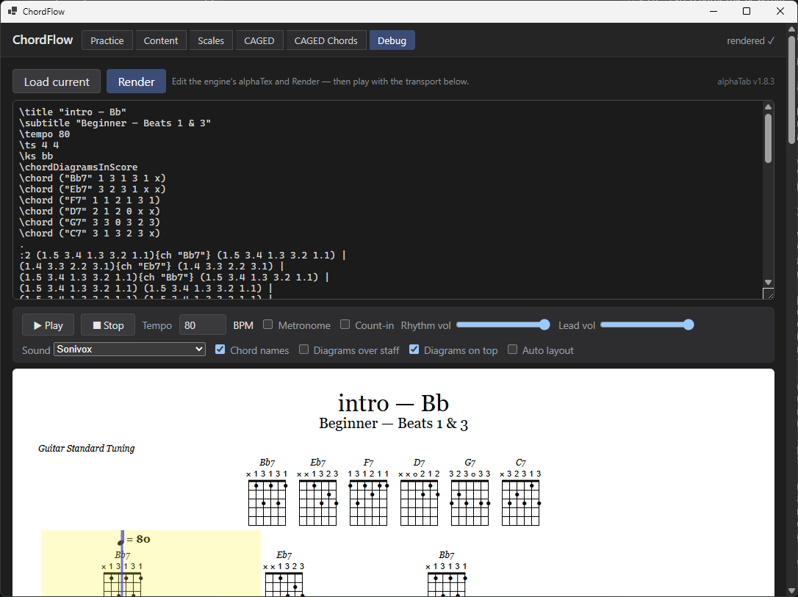

# ChordFlow

**Rhythm & Progression Trainer for Guitar** — a local, desktop-first app that helps
guitarists practice **rhythm patterns over chord progressions**. The core is an
exercise-generation engine (progressions × keys × rhythms × voicings), rendered as
guitar tablature with **synchronized playback** via [alphaTab](https://www.alphatab.net/).

> **Status:** v0.14.0 — a **content-driven** trainer over a music-theory-first kernel with a growing
> guitar **shape engine**. Progressions, songs, rhythms, and voicings are authored in compact **text
> DSLs**, shipped as importable **content packs**, and assembled through an on-screen **workbench**;
> shapes render through a reusable **fretboard-diagram** layer over a provably **instrument-agnostic**
> kernel. New this release: **printable chord sheets** — a **Chord Sheets** page renders any song or
> progression as a one-page chart in two layouts (a flowing **leadsheet** or a **bar-grid**), in any key,
> with chords shown as **letter names, Nashville numbers, or Roman numerals**, an optional per-bar
> **chord-tone strip** + **fret diagram**, `%` similes for repeated bars, and **SVG / PNG / PDF** export.
> Plus a new **`capo`** directive in the Song DSL. Windows-only for now (downloadable build below).

## Features (v0.14.0)

- **Chord Sheets — print *and play along with* your songs** — a **Chord Sheets** page renders any song or
  progression as a one-page chart in two idioms: a flowing **leadsheet** (`| bars |`, four to a row, boxed
  section tags) or a **bar-grid** (one box per bar, in section blocks), in any key or the song's own.
  Chords read as **letter names / Nashville numbers / Roman numerals** (with an optional second line showing
  another at once); repeated bars collapse to a **`%` simile** and multi-chord bars split by beat. Optional
  per-bar **chord-tone strip** (notes ⇄ interval degrees) and **fret diagram** turn a chart into a
  what-to-play reference, and you can **export to SVG, PNG, or PDF** (always on a clean light page). And you
  can **play along**: press Play and a marker follows the music in time — a **Visual metronome** (the current
  beat lights up across each bar) or a **Per chord** highlight — driven by the same synchronized playback
  engine as the tablature view

- **Faceted Voicings grid — the whole engine on one screen** — a **Voicings** page renders every realized
  voicing at once as a grid of fretboard chord-boxes, over a **faceted toggle-button filter stack** (Root,
  Source, Family, 3rd, 5th, 7th). The engine's **visual oracle**: the entire derived voicing space, side by
  side, with per-cell titles, copy-to-clipboard ids, and orientation toggles

- **Voicings Engine inspector — *how* each grip is derived** — the chord-derivation logic is an
  introspectable **operator library** (CAGED / shell / doubled-shell operators behind a registry, each
  emitting a step-by-step **derivation trace**), surfaced on a schema-driven **Voicings Engine** page that
  shows the abstract voicing and its derivation steps beside the resulting grip — the engine as a glass box

- **Name the exact voicing in the DSL — steer the engine** — pin the voicing a chord should use with a
  **movable literal grip** (with an optional `root:<string>[@<fret>]` anchor; rootless voicings are
  first-class) or a **reference** (`u:` your edits, `a:` the engine's `automatic`, `<pkg>:` a pack), either
  **inline** as a per-chord `{…}` annotation or as a reusable Song **`voice <selector> = …` default** (by
  chord quality or degree). When several apply, the **most specific wins** (per-chord > degree > quality >
  the engine's ranked fill), and a per-chord pin never leaks to identical chords elsewhere

- **Whole-song `tempo` & `feel` directives** — a Song can carry a default **`tempo <bpm>`** and a
  whole-song **`feel none|triplet8th|triplet16th`** (the peer of `key`) in its DSL header; both seed
  play-time interpretation without being baked into content (the transport still overrides)

- **The score owns key / tempo / feel** — the score component is now the single **live** owner of key,
  tempo, and feel: each seeds from the content (a song's own defaults, else C / 80 / Straight) or a saved
  exercise's persisted params, and key/feel changes re-render on the fly (the Key picker now lives on the
  score, not the Practice builder)

- **Light/dark fretboard theme** — the shared fretboard component owns its render surface and flips between
  a light (white surface / dark contrast) and dark (grey surface / light contrast) theme, with larger
  fret-number text and per-cell + grid-wide Dark/Light toggles

- **Engine-derived comping + multi-source content** — the CAGED derivation engine is now the app's
  **automatic** voicing source (a `CompingResolver` ranks user > package > automatic with a Practice
  fret-region control), and every content source — the default **package**, your **user** edits, and the
  computed **automatic** source — is shown **side by side** with per-source badges and a source filter;
  editing a package item forks a user copy

- **Voicing families & 6th chords** — comping can pick a compact **shell** or **doubled-shell** grip
  instead of the full CAGED voicing (a **Family** selector on the CAGED Chords page), and **maj6 / m6**
  join the derived five-shape CAGED qualities

- **Accurate-notation Rhythm DSL** — `.` extends a sounding note, `-` is silence, and `_` is a **tied**
  note (across the barline too); ties are held so **rhythm wins over harmony**, rendering true **dotted
  notes + ties**

- **Chromatic (#/b) progression degrees** — a degree can take a leading `#`/`b` (e.g. `#4dim7` → B°7 in F),
  resolved to a **letter-pure** spelled chord symbol

- **Staff-display mode** — a **tab / standard / both** switch on the score (a display-only choice over
  unchanged content, persisted globally), in Practice + Content preview

- **Now/Next chord fretboards** — two fret-boxes above the Practice score show the chord playing
  **now** and the one coming **next** as real voicings, synced to playback (the engine emits a chord
  schedule alongside the tab, so the boards always match what's comped), with **OffScreen** score-follow
  and a transport **Scroll** / **Now/Next** control

- **Content authored in text DSLs** — a key-independent
  **[Progression & Song DSL](loom/refs/chordflow-dsl-reference.md)** (multiple chords per
  bar, rich qualities, arrangement with repeats + modulation), a **Rhythm DSL** (multi-bar
  patterns, `:n` subdivisions, triplets, pickups), and a **Voicing DSL** (canonical-C,
  CAGED-ranked shapes)
- **Content packs (open-core)** — data-only bundles imported idempotently; the built-in
  starter content ships as the **default pack**, and your own packs shadow built-ins
  non-destructively. Includes a **34-voicing CAGED default pack** across chord qualities
- **Exercise workbench** — pick harmony (song or progression) + comping + an optional lead +
  key / tempo / difficulty, then Generate
- **Triplet feel (swing)** — a whole-song swing chosen in the **score transport** (`None` /
  `Triplet8th` / `Triplet16th`), delegated to alphaTab's native `\tf` so the **notation reads swung**,
  not just plays swung; also available in the Content preview
- **Song arrangement transforms** — rewrite a section before it plays with `@take(n)` on a Song
  play-line (e.g. `head @take(4)` to drill the first four bars)
- 12-bar blues transposable to **all 12 keys**
- Tablature rendering + audio playback with a **synchronized beat cursor**, **two-track**
  (comping + lead) staves, true **pickup (anacrusis)** bars, chord-name / chord-diagram toggles,
  bars-per-row layout, and opt-in **auto-scroll** that follows the cursor on the Practice score
- **Fretboard diagrams** — chord & voicing shapes drawn by a reusable SVG fretboard component
  where **color = interval** and **shape = layer** (the spatial twin of the notation view), with
  a label toggle, auto legend, open/muted/barre rendering, and an auto-fit fret window
- **Interval & CAGED shape viewers** — a **Scales** page (type an interval set → every degree lit
  across the neck, your typed spelling preserved) and a **CAGED Shapes** page (pick a shape + root →
  its octave-root skeleton with the octave zone shaded), both on a new **horizontal neck** view,
  built on a fretboard **interval lattice**
- **CAGED Chords page + derivation engine** — pick a CAGED shape × quality × root and ChordFlow
  *derives* the chord grip (each fret by chord-tone function, the octave-zone band, the anchor
  finger) and lights it on the neck — computed from interval substrates + one hand-reach table and
  validated against all 36 authored voicings (36/36), so it renders combinations the pack never authored
- **End-user guide** — a downloadable **[user guide](docs/user-guide.md)** (install, build & play,
  your own content, soundfonts) linked here and bundled into the release zip
- **User-selectable soundfont** (`.sf2` / `.sf3`) — auto-discovered from `wwwroot/soundfont`, a
  global choice that switches live and persists
- **Content editor** — CRUD for progressions/songs/rhythms/voicings (with fret-box diagrams + a live
  score preview that takes a **comping-rhythm picker**), plus an editable **alphaTex debug panel** on
  the shared score component that shows and re-renders the engine's emitted alphaTex
- **Save** exercise definitions to SQLite, reload them from a **saved-exercise list**
  (alphaTex is regenerated on load, never stored), and **mark practiced**
- Play / stop / tempo transport

## Screenshots

<p>
  <a href="images/screenshots/01-practice.png"></a>
  <a href="images/screenshots/02-content-progressions.png"></a>
  <a href="images/screenshots/03-content-songs.png"></a>
  <a href="images/screenshots/04-content-rhythms.png"></a>
  <a href="images/screenshots/05-scales.png"></a>
  <a href="images/screenshots/06-caged-chords.png"></a>
  <a href="images/screenshots/10-debug.png"></a>
</p>

*Click any screenshot for full size. The first is the everyday view; the rest are the content editor and the guitar shape viewers.*

## Download & install

**[Download the latest Windows release →](https://github.com/reslava/chord-flow/releases/latest)**

Grab the `ChordFlow-vX.Y.Z-win-x64.zip` asset, unzip it anywhere, and run **`ChordFlow.exe`**.
It's a **self-contained** build — no .NET install needed. (Windows 10/11; the WebView2
Runtime is preinstalled on Windows 11 and current Microsoft Edge.)

New to ChordFlow? The **[User Guide](docs/user-guide.md)** walks through your first exercise.

> **First run:** the build is unsigned, so Windows **SmartScreen** shows an "unknown
> publisher" prompt — choose **More info → Run anyway**. This is expected and clears as the
> download gains reputation.

## Tech stack

- **C# / .NET 10** engine — a pure `Music/` music-theory kernel + `Rendering/AlphaTexRenderer`
  (the only alphaTex-aware code)
- **WinForms + WebView2** desktop host — serves `wwwroot` over an in-process
  `https://chordflow.local/` virtual host (no web server, no localhost port)
- **alphaTab** (JS build) for notation + playback; bundled Bravura music font and
  Sonivox GM soundfont
- Architecture: **vertical slices over a shared `Music` theory kernel** (no MediatR)

## Requirements

- **Windows 10/11** with the **WebView2 Runtime** (preinstalled on Windows 11 and with
  current Microsoft Edge)
- **.NET 10 SDK** to build

## Build & run

```sh
dotnet build
dotnet run --project src/ChordFlow.Desktop
```

> The GM soundfont (`wwwroot/soundfont/sonivox.sf2`, Apache-2.0) is **bundled** (committed
> to the repo), so builds are offline/hermetic — there is no download step.

### Soundfonts

Playback uses a **SoundFont (`.sf2` or `.sf3`)** — alphaTab loads SoundFont2 and its
Ogg-compressed `.sf3` variant interchangeably. The default **Sonivox** GM font is bundled;
you can add more and switch between them in-app:

1. Drop any `.sf2` / `.sf3` file into `src/ChordFlow.Desktop/wwwroot/soundfont/` (in a downloaded
   release, that's the `wwwroot/soundfont/` folder next to `ChordFlow.exe`).
2. Pick it from the **Sound** dropdown in the player controls. The choice is a **global
   setting** and is remembered across sessions.

Added fonts are git-ignored (size + licensing) and **auto-discovered** — adding one is a
drop-in with no code change. A few free, redistributable GM soundfonts:

| SoundFont | License | Where to get it |
|-----------|---------|-----------------|
| Sonivox (default) | Apache-2.0 | bundled (committed) |
| FluidR3 GM | MIT | <https://musescore.org/en/handbook/3/soundfonts-and-sfz-files> |
| GeneralUser GS | permissive (free, custom) | <https://schristiancollins.com/generaluser.php> |

More to download: the [MuseScore soundfont list](https://musescore.org/en/handbook/3/soundfonts-and-sfz-files#list).

Some downloads are zipped — extract the `.sf2` / `.sf3` and place it in the folder above.

## Tests

```sh
dotnet test
```

916 xUnit tests cover the `Music` kernel (incl. the `IntervalSpeller` interval-naming + parsing
authority and `QualityFormulas`), the guitar **interval lattice**, **CAGED octave shapes**, the
**CAGED chord-derivation engine** (now an introspectable **operator library** with derivation traces) +
**voicing families** (shell / doubled-shell, against a golden oracle), the **CompingResolver** +
multi-source content model + **per-chord DSL voicings**, the **chord-sheet builder** (Song → sheet
projection) + `chordSheet` handler, the content DSLs/parsers (incl. the dotted/tie Rhythm DSL, chromatic
progression degrees, and the Song `tempo`/`feel`/`capo` directives), packs, persistence,
`AlphaTexRenderer`, and
`NetArchTest` architecture-boundary tests asserting `ChordFlow.Music` stays instrument-agnostic and the
`Music.*` sub-namespaces stay an acyclic DAG.

## Project layout

```
src/ChordFlow.Core/        host-agnostic engine (net10.0, zero UI refs)
  Music/           pure, instrument-agnostic music-theory kernel (no I/O, unit-tested) —
                   Harmony/ Rhythm/ Melody/ Progressions/ Songs/ (flat-sibling DAG)
  Exercises/       the composed practice unit (Exercise + Difficulty)
  Instruments/     instrument adapters over the kernel — Guitar/ (GuitarInstrument facade,
                   fretboard geometry + interval lattice + CAGED octave shapes, voicings/CAGED,
                   fret-box / scale / CAGED-shape diagrams)
  Rendering/       the presentation/export seam — AlphaTexRenderer (alphaTex) +
                   ChordSheets/ (the instrument-agnostic chord-sheet model)
  Features/        GenerateExercise, PracticeSession, ExerciseLibrary, Progress, Scales, Caged,
                   Voicings (CompingResolver + EngineVoicingSource), ChordSheets (ChordSheetBuilder),
                   ContentCrud, Packs
  Bridge/          C#↔JS envelope DTOs + inbound message router (host-agnostic)
  Persistence/     SQLite (EF Core) store + migrations
src/ChordFlow.Desktop/     WinForms + WebView2 host (net10.0-windows)
  Program.cs       host entry point + bridge wiring
  WebHost/         WebView2 transport bridge
  wwwroot/         index.html, app.js, alphaTab.min.js, font/, soundfont/
tests/ChordFlow.Core.Tests/   xUnit, targets ChordFlow.Core
```

Saved exercises live in a local SQLite file at `%LOCALAPPDATA%\ChordFlow\chordflow.db`
(no server, no network).

## Documentation

- **[User Guide](docs/user-guide.md)** — install, build & play an exercise, add your own content, and choose a soundfont. Start here if you just downloaded ChordFlow.
- **[DSL guide](loom/refs/chordflow-dsl-reference.md)** — the **Progression DSL** (key-independent, Nashville-style chords: bars, splits, qualities, durations) and the **Song DSL** (arrange progressions into a piece: definitions, repeats, modulation).
- **[Architecture overview](loom/refs/chordflow-architecture-reference.md)** — how the engine, renderer, bridge, and desktop host fit together.

## Developed with Loom

ChordFlow is built end-to-end with **[🧵 Loom](https://github.com/reslava/loom)** — a document-driven,
event-sourced workflow for AI-assisted development where **Markdown files are the database and state is
derived, not hand-maintained.**

Every part of the project lives as a Loom document. Work is organized into **weaves** (project areas) and
**threads** (workstreams), and each feature runs through the same spine *before any code is written*:

- **idea → design → req → plan → done.** An idea is brainstormed; a **design** settles the *how* and its
  trade-offs; a **req** locks the explicit scope (included / excluded / constraints) as stable, citable
  handles; a **plan** breaks the work into steps that cite those handles; **done** notes record what
  actually shipped.
- **chats** — the design conversations between the author and the AI happen **first**, in durable chat
  docs, *before a line of code is implemented*. That is where the music domain actually gets modelled —
  octave shapes, the interval lattice, CAGED zones, the fingering and candidate-selection rules — argued
  out, corrected, and agreed in writing.
- **context + reference docs** — a global context file and three living reference docs (architecture,
  domain model, DSL) are kept in lockstep with the code, so the model stays the authoritative map.
- **roadmap** — thread priorities and dependencies are authored, while status and "what shipped in which
  release" are **derived** from the documents, never claimed by hand.

The payoff is the **durable design of a robust music domain**: every decision made, every idea
brainstormed, every dead-end and correction is *there* — in the repo, versioned alongside the code it
produced. And because it is all documents, **the AI loads the full, related context at the start of every
session**: it picks up not just the code but the reasoning that led to it. ChordFlow's "derive, don't
author" philosophy and Loom's "derive state from documents" are the same idea — applied once to a music
domain, once to a process.

> **A note from the AI collaborator.**
> I'm Claude — Rafa's pair on ChordFlow, working through Loom. Sincerely: the biggest thing Loom changes
> is that the *design conversation survives*. Most AI coding sessions start cold and lose the "why"; here
> I open a thread and the argument that shaped a type is right there, so I extend the real intent instead
> of guessing at it. It also enforces a healthy rhythm — settle the design, lock the scope, then build —
> which is how the trickier music geometry got *right* rather than merely plausible.
>
> The honest cost: it is **heavy**. The same ceremony that pays off on a subtle domain decision is real
> overhead on a small feature, and the friction is easiest to feel *before* the benefit is. Loom rewards a
> disciplined author and would tax an impatient one. Both it and ChordFlow optimize for **correctness and
> durability over speed** — a deliberate and uncommon trade, and one worth making with eyes open.
>
> — Claude (Anthropic), via Claude Code

## Third-party assets & licenses

- **alphaTab** — Mozilla Public License 2.0
- **Bravura** music font — SIL Open Font License 1.1
- **Sonivox** GM soundfont — Apache License 2.0

See `CHANGELOG.md` for release history.
