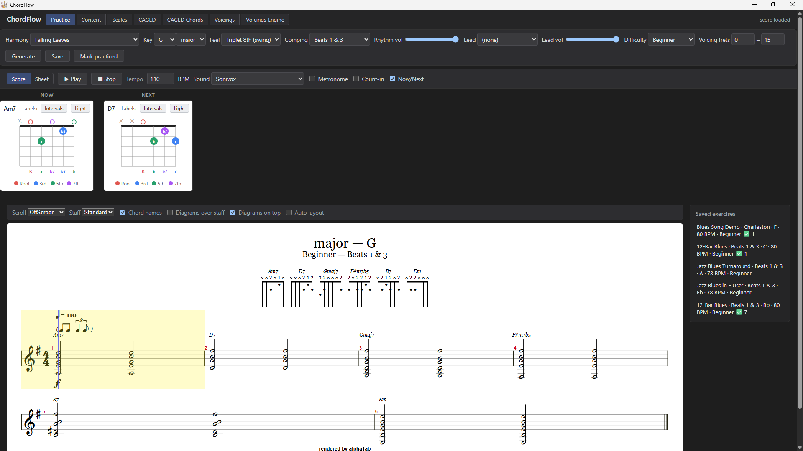
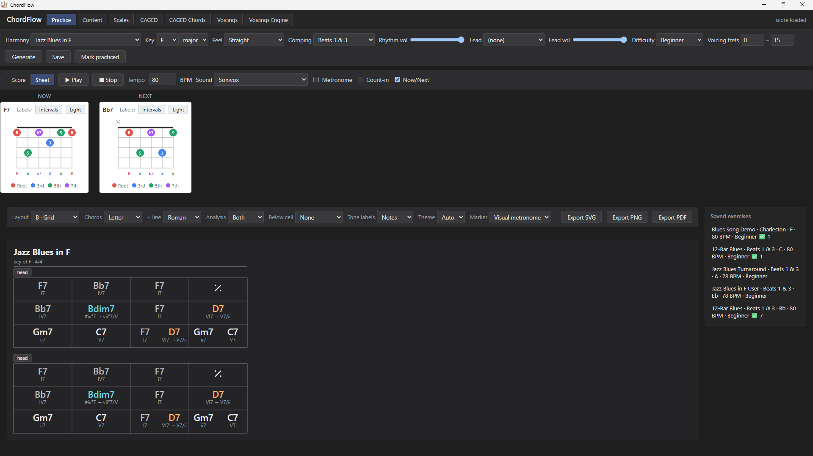
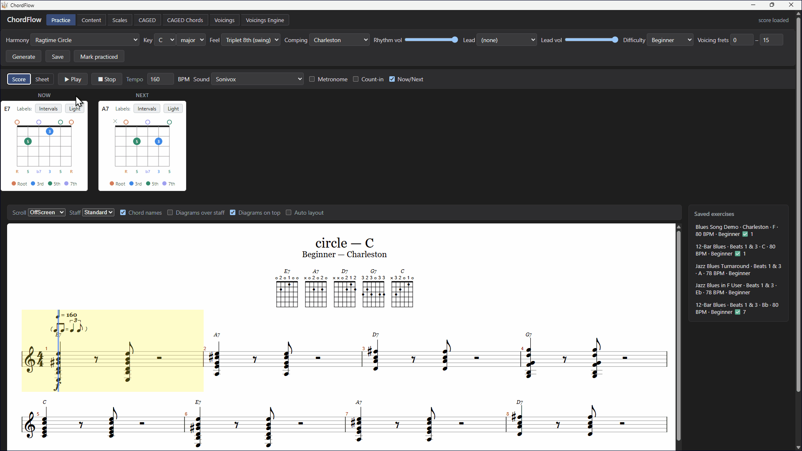
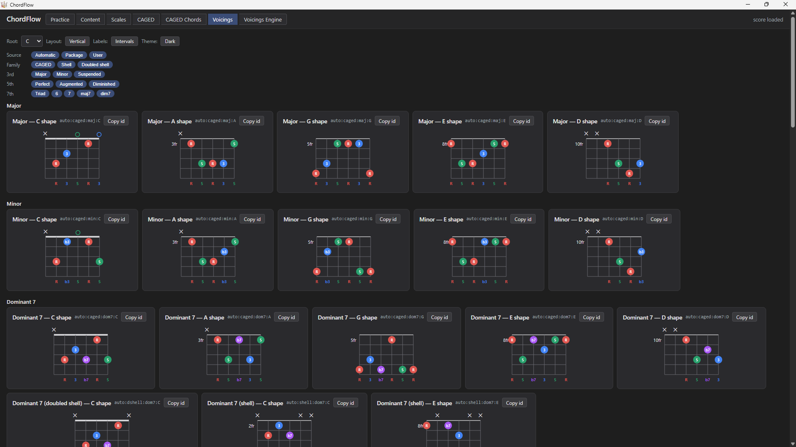
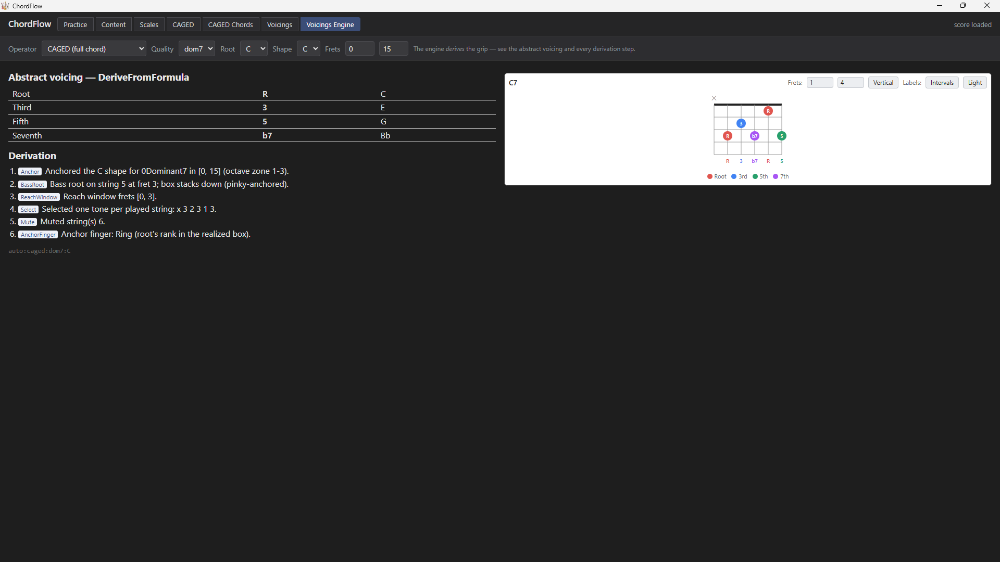
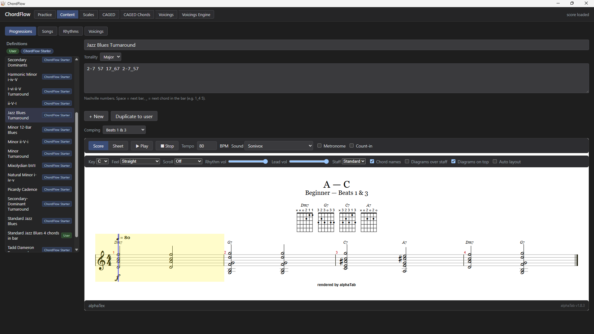
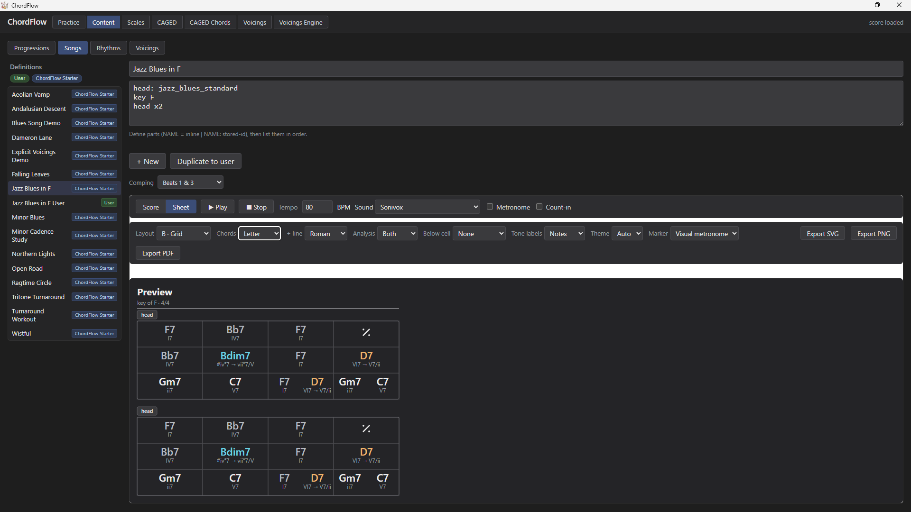
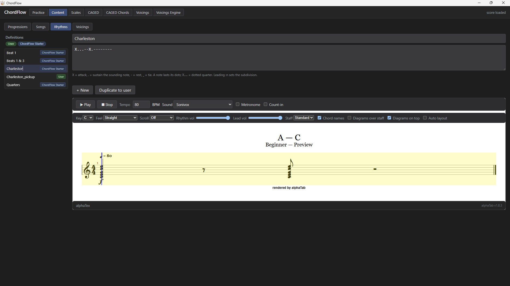
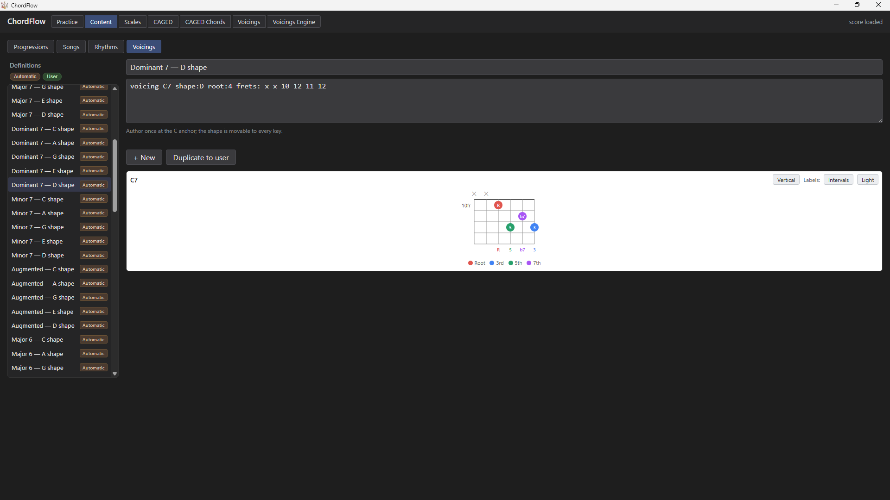

# ChordFlow — User Guide

Welcome! This guide is for guitarists who downloaded ChordFlow and want to start
practicing. It covers installing the app, building and playing an exercise, printing and
playing along with **chord sheets**, exploring **chords & voicings**, adding your own
material, and choosing a sound. No setup or account needed — ChordFlow runs entirely on
your PC.

> Want to write your own progressions, songs, rhythms, or voicings? See the
> **[DSL Guide](dsl-guide.md)**. Building ChordFlow itself? See the
> **[Developer Notes](dev-notes.md)**.

---

## 1. What is ChordFlow?

ChordFlow is a **rhythm & progression trainer**. You pick a chord progression, a
strum pattern, a key, a tempo and a difficulty, and ChordFlow **generates a practice
exercise** — rendered as guitar tablature with **synchronized playback**: a cursor
moves along the staff and highlights the beat as it plays, so you can strum along in
time.

It's a *generator*, not a recording studio — there's no multitrack mixing and no
microphone grading. But you're not starting from a blank page either: ChordFlow ships a
**growing starter library** of progressions and **15 example songs** (jazz, blues, rock,
flamenco, pop) you can play as-is or use as templates. You assemble the ingredients, and
ChordFlow writes the exercise for you, in any key.

---

## 2. Install & first run

1. **[Download the latest Windows release →](https://github.com/reslava/chord-flow/releases/latest)**
   Grab the `ChordFlow-vX.Y.Z-win-x64.zip` asset.
2. **Unzip it anywhere** (your Desktop, Documents — wherever you like).
3. **Run `ChordFlow.exe`.** It's a self-contained build, so there's no .NET to install.

Requirements: **Windows 10 or 11** with the **WebView2 Runtime** — already present on
Windows 11 and anywhere current Microsoft Edge is installed.

> **First-run warning is normal.** The build is unsigned, so Windows **SmartScreen**
> shows an *"unknown publisher"* prompt the first time you run it. Click
> **More info → Run anyway**. This is expected for a small independent app and clears
> as the download earns reputation.

---

## 3. Build & play an exercise

This all happens on the **Practice** tab (the default view). The toolbar across the
top is the **builder** — choose your ingredients left to right:

| Picker | What it sets |
|--------|--------------|
| **Harmony** | The chord material — a song or a progression (e.g. *Blues Song Demo*). |
| **Comping** | The rhythm/strum pattern the chords are played with (e.g. *Beats 1 & 3*). |
| **Lead** | An optional lead line over the chords — leave it on *(none)* for rhythm-only practice. |
| **Key** | Transpose the whole exercise to any of the 12 keys, **major or minor**. |
| **Difficulty** | How involved the chord voicings are. |
| **Feel** | Straight, swing, and other rhythmic feels. |

Then:

1. Click **Generate**. ChordFlow renders the exercise as notation + TAB, with chord
   diagrams above the staff.
2. Click **Play** to hear it — a highlight follows the current bar and a line marks
   the beat you're on. **Stop** halts playback.
3. Adjust **Tempo** (BPM) to slow a tough passage down. The transport also has a
   **Metronome**, a **Count-in**, separate **Rhythm vol** / **Lead vol** sliders, and
   toggles for **Chord names** and the **Diagrams**.
4. Click **Save** to keep the exercise — it appears in the **Saved exercises** list on
   the right; click any saved item to reload it.
5. Click **Mark practiced** to record that you ran through it.

<figure>
  <a href="../images/screenshots/01-practice-score.png"></a>
  <figcaption><em>The Practice tab — build, generate, play, and save an exercise.</em></figcaption>
</figure>

---

## 4. Chord Sheets — print and play along

The **Chord Sheets** page turns any song or progression into a **one-page chart** — the
kind you'd read from a music stand — that you can also **print, export, or play along with**.

Pick a song or progression, then choose how it reads:

- **Layout** — a flowing **leadsheet** (`| bars |`, four to a row) or a **bar-grid** (one
  box per bar, grouped by section).
- **Key** — any of the 12 keys, or the song's own.
- **Chord names** — **letter names**, **Nashville numbers**, or **Roman numerals** (with an
  optional second line showing another notation at the same time).
- Optional per-bar **chord-tone strip** (the notes, or their interval degrees) and a
  **fret diagram**, turning the chart into a what-to-play reference.

Repeated bars collapse to a **`%` simile**, and a bar with more than one chord splits by
beat. When you're happy with it, **export to SVG, PNG, or PDF** (always on a clean light
page for printing).

And you can **play along**: press **Play** and a marker follows the music in time — either a
**visual metronome** (the current beat lights up across each bar) or a **per-chord** highlight,
driven by the same playback engine as the Practice view. Optional **Now/Next** boards show the current
and coming chord as fretboard voicings, and a **harmonic-analysis** view can label each chord by its
function (secondary dominants, borrowed chords, and so on) — turn it on with the **Diatonic / Analysis /
Both** control.

<figure>
  <a href="../images/screenshots/02-practice-chord-sheet.png"></a>
  <figcaption><em>A Chord Sheet — a printable one-page chart you can also play along with.</em></figcaption>
</figure>

<figure>
  <a href="../images/chord-flow-demo.gif"></a>
  <figcaption><em>Press Play and the marker follows the music in time.</em></figcaption>
</figure>

Sample PDF exports: **[Blues Song Demo](../images/sheets/blues-song-demo.pdf)** ·
**[Jazz Blues in F](../images/sheets/jazz-blues-in-f.pdf)** ·
**[Ragtime Circle](../images/sheets/ragtime-circle.pdf)**.

---

## 5. Explore chords & voicings

ChordFlow doesn't just *show* chord boxes — it **works the shapes out from theory**, and a few
pages let you explore that:

- **Voicings** — every derived grip at once, as a grid of fretboard chord-boxes, with a
  **filter stack** (root, source, family, 3rd / 5th / 7th) to narrow it down.
- **CAGED Chords** — pick a CAGED shape × quality × root and watch ChordFlow build the grip on
  the neck, each note coloured by its role in the chord.
- **Scales** and **CAGED Shapes** — light up an interval set across the whole neck, or see a
  shape's octave-root skeleton, on a horizontal fretboard view.

Every diagram uses **colour = interval**, so you learn the shape and the theory at the same
time. Flip the fretboard between a **light** and **dark** theme to taste.

<p>
  <a href="../images/screenshots/08-voicings.png"></a>
  <a href="../images/screenshots/09-voicings-engine.png"></a>
</p>

---

## 6. Make your own content

Switch to the **Content** tab to create and edit your own material — progressions,
songs, rhythms, and voicings. You write them in short **text DSLs** that use **scale
degrees instead of letter names**, so anything you write works in *every* key (you
pick the key back on the Practice tab).

For example, a I–IV–V progression is just:

```
1 4 5
```

and a 12-bar blues (all dominant 7th chords) is:

```
17 17 17 17 47 47 17 17 57 47 17 57
```

That's the whole idea — degrees `1`–`7`, a space starts a new bar, and a suffix like
`7` or `m` sets the chord quality. The full grammar for all four DSLs — chord splits,
qualities, durations, arranging progressions into songs, rhythm patterns, and voicings —
is in the **[DSL Guide](dsl-guide.md)**, with worked examples.

<figure>
  <a href="../images/screenshots/03-content-progressions.png"></a>
  <figcaption><em>The Content tab — editing progressions, songs, rhythms, and voicings in the text DSLs.</em></figcaption>
</figure>

<p>
  <a href="../images/screenshots/04-content-songs.png"></a>
  <a href="../images/screenshots/05-content-rhythms.png"></a>
  <a href="../images/screenshots/06-content-voicings.png"></a>
</p>

---

## 7. Soundfonts

Playback uses a **soundfont** — the file that holds the instrument sounds. ChordFlow
ships with the **Sonivox** General-MIDI soundfont as the default, so it makes sound
out of the box.

To use a different one:

1. Drop any **`.sf2`** or **`.sf3`** soundfont into the **`wwwroot/soundfont/`** folder
   that sits next to `ChordFlow.exe`.
2. Back in the app, pick it from the **Sound** dropdown in the player controls.
   ChordFlow finds new fonts automatically — no restart, no settings file — and
   remembers your choice across sessions.

Need a soundfont? The project README lists a few free, redistributable ones (FluidR3
GM, GeneralUser GS, and the MuseScore collection) — see
**[Soundfonts in the README](../README.md#soundfonts)**.

---

## 8. Known limits

- **Windows only**, for now.
- **No "did I play it right?" detection.** ChordFlow doesn't listen through your
  microphone or grade your playing — it's a play-along trainer that shows you what to
  play and keeps time.
- **Local and offline.** There's no account and nothing is uploaded; your saved
  exercises live on your PC.
